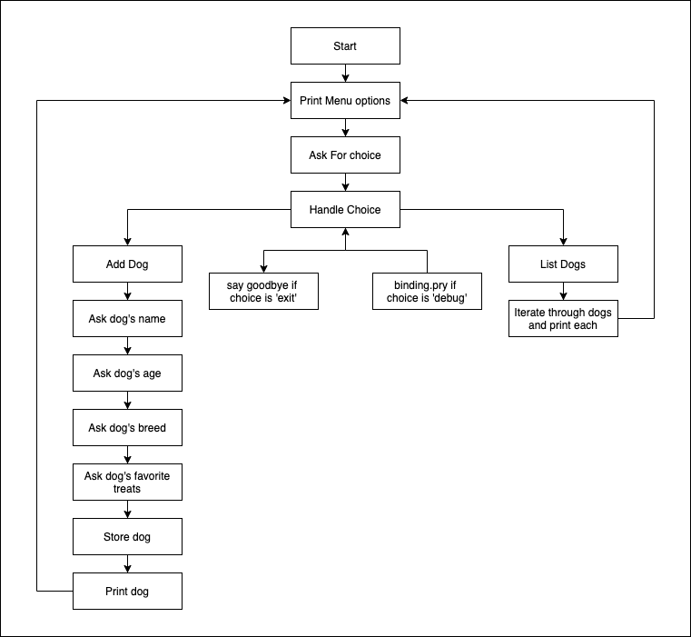

# Ruby Fundamentals

Welcome to ruby fundamentals! For the first couple of phases, we focused our attention on JavaScript and then React, so we have a good idea now of how we can build a web based application that runs in the browser. The part of a web application that runs in the browser is called the frontend of a full stack web application. What we don't know how to do yet is to build out our own custom backend with logic that we can control, complicated database relationships and persistence. Learning how to build out the backend is going to be the focus of Phase 3.

We're also switching languages to Ruby to do this. At the end of the phase, you'll build out a react application that can connect to a backend API written in ruby code that you can send fetch requests to and get/persist related data. One of the main reasons we're switching languages to Ruby for this part of the course is that there are robust tools already in place for creating rock solid APIs in Ruby. During this phase we'll be introducing a library called ActiveRecord which you'll be using extensively in Phase 4 and beyond. ActiveRecord gives you the tools to build out your domain model for the application you want to build and the ability to store and access all of its required data and behavior. 


To start, because we need to get used to Ruby, we'll be building a simpler application that will run in our terminal. At the end of the phase, we'll take the features we've been building for our application and set up a web server that will allow a react app to make fetch requests to interact with the application. At the end of the phase, it'll look something like what we have above.

## Lecture Format

Lectures will be split into 2 portions, with a 10 minute break in between.
- Part 1: Demo of how to apply concepts from labs and lessons to our dog walker application
- Part 2: Student Exercise in breakouts to apply concepts from demo to another codebase, followed by a review and discussion.
## Dog Walker CLI Part 1

Over the next few weeks, we're going to be work on a dog walking application. As we introduce new features to it, we'll be using the concepts covered in the lessons and labs to demonstrate how they are applied to a real situation and put them to work! 

In this directory, we'll put our Ruby code in the files in the `lib` directory. The way we'll get visual feedback about how our code is working is via a text based interface at the command line. We call this kind of application a CLI (Command Line Interface) for short.

The code for our cli will be written in the file `lib/dog_walker_cli.rb`. We'll start our cli application by running the following command in our terminal:

```bash
./bin/run
```

If you have issues running this command in your terminal, you may need to add executable permissions to this file using the following command in your terminal:

```bash
chmod +x ./bin/run
```

The file looks like this currently: 

```rb
#!/usr/bin/env ruby

require_relative "../config/environment"

start_cli
```

The top line in the file is telling bash to use the ruby interpreter to run this file. By adding this line, we're able to execute the file with the following command:

```bash
./bin/run
```
 
instead of needing to prefix the path to the file with `ruby` like so:

```bash
ruby ./bin/run
```

Below that, the `require_relative "../config/environment"` line is loading a file that is a relative path away from the path to the current file. Since this file is inside of the `bin/` directory, a `.` would refer to the `bin/` directory, and a `..` refers to the parent of the `bin/` directory, which in our case is the root of our project. From there, we add a `/` to go down a level into the `config` directory and then add another `/` to indicate that the file we want to load, `environment`, is inside of that directory. Both `require` and `require_relative` load individual files, not directories. 

>The difference between `require` and `require_relative` is a bit tricky to understand in all of its details. At this point, what you'll want to be aware of is that you'll be using `require` to load code defined in an external gem you've included in your `Gemfile` (equivalent of `package.json`). And, when you load code that you wrote in another file, you'll use `require_relative` for that and you'll be using it the same way you would with an `import` statement in React. **A notable difference** is that in ruby we're not using `export`, so when we do a `require_relative` in ruby, we're actually loads all methods defined within that file.

Okay, so let's take a look at the `config/environment.rb` file to see what we're loading.

```rb
# require is like an import statement except it loads all methods from the required file (not just the default export)
require "bundler/setup"
# Here we're calling a method that requires all of the ruby gems in the default environment (not in a group like development or test) For our purposes, this will load require_all and pry so that we can use `require_all` and `binding.pry` within our code. We do this so that we don't have to individually require all of our dependencies defined in the Gemfile.
Bundler.require(:default)
# One of our dependencies that we loaded in the previous expression was the require_all gem. It gives us a method called `require_all` that allows us to require all of the files within a directory. The path we pass to it will be relative to the root path of the project (where the Gemfile is). In our case, we're loading all of the files inside of the lib directory, so if we write code in there (like a method) it will be accessible to us after the require_all below
require_all "lib"
```

This file contains the ruby code necessary to set up our dependencies and load up our code so we can interact with it. Later on, there are a couple of different places we need to do this, so putting this configuration in a file and then requiring the file will ensure we don't have to change this configuration in multiple places.

## Demo

- Take user input
- Ask user the name of their dog
- Ask the user their dog’s breed
- Ask the user their dog's age
- Ask the user to enter their dog's favorite treats
- Ask the user if they’d like to take the dog for a walk
- Add a menu to the cli
  - 'add dog' to ask user for input to create a new dog - use pry to verify the dog has been - added to the array of dogs
  - 'Info' print info about all dogs including name, age, breed, last feeding time and last pooped time
- Introduce program loop

Here's a sketch of the flow of the program we're going to create:

