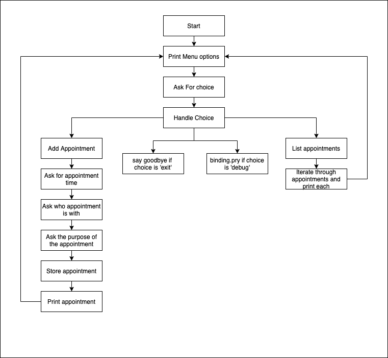

# Doctor Appointments CLI Part 1

Welcome to ruby fundamentals! Over the next couple of weeks, you're going to be working on an appointment tracking application. As we introduce new features to it, we'll be using the concepts covered in the lessons and labs to demonstrate how they are applied to a real situation and put them to work! 

In this directory, we'll put our Ruby code in the files in the `lib` directory. Because we're moving our focus away from react for the first couple of weeks of this phase, the way we'll get visual feedback about how our code is working is via a text based interface at the command line. We call this kind of application a CLI (Command Line Interface) for short.

The code for our cli will be written in the file `lib/appointments_cli.rb`. We'll start our cli application by running the following command in our terminal:

```bash
./bin/run
```

If you have issues running this command in your terminal, you may need to add executable permissions to this file using the following command in your terminal:

```bash
chmod +x ./bin/run
```

The file looks like this currently: 

```rb
#!/usr/bin/env ruby

require_relative "../config/environment"

start_cli
```

The top line in the file is telling bash to use the ruby interpreter to run this file. By adding this line, we're able to execute the file with the following command:

```bash
./bin/run
```
 
instead of needing to prefix the path to the file with `ruby` like so:

```bash
ruby ./bin/run
```

Below that, the `require_relative "../config/environment"` line is loading a file that is a relative path away from the path to the current file. Since this file is inside of the `bin/` directory, a `.` would refer to the `bin/` directory, and a `..` refers to the parent of the `bin/` directory, which in our case is the root of our project. From there, we add a `/` to go down a level into the `config` directory and then add another `/` to indicate that the file we want to load, `environment`, is inside of that directory. Both `require` and `require_relative` load individual files, not directories. 

>The difference between `require` and `require_relative` is a bit tricky to understand in all of its details. At this point, what you'll want to be aware of is that you'll be using `require` to load code defined in an external gem you've included in your `Gemfile` (equivalent of `package.json`). And, when you load code that you wrote in another file, you'll use `require_relative` for that and you'll be using it the same way you would with an `import` statement in React. **A notable difference** is that in ruby we're not using `export`, so when we do a `require_relative` in ruby, we're actually loads all methods defined within that file.

Okay, so let's take a look at the `config/environment.rb` file to see what we're loading.

```rb
# require is like an import statement except it loads all methods from the required file (not just the default export)
require "bundler/setup"
# Here we're calling a method that requires all of the ruby gems in the default environment (not in a group like development or test) For our purposes, this will load require_all and pry so that we can use `require_all` and `binding.pry` within our code. We do this so that we don't have to individually require all of our dependencies defined in the Gemfile.
Bundler.require(:default)
# One of our dependencies that we loaded in the previous expression was the require_all gem. It gives us a method called `require_all` that allows us to require all of the files within a directory. The path we pass to it will be relative to the root path of the project (where the Gemfile is). In our case, we're loading all of the files inside of the lib directory, so if we write code in there (like a method) it will be accessible to us after the require_all below
require_all "lib"
```

This file contains the ruby code necessary to set up our dependencies and load up our code so we can interact with it. Later on, there are a couple of different places we need to do this, so putting this configuration in a file and then requiring the file will ensure we don't have to change this configuration in multiple places.



When it's complete, it should look something like this:


## TIPS

If you set up a `debug` option in your menu that opens up a binding.pry session, you can do all sorts of things with that. You can check what's currently inside of `APPOINTMENTS` to test that your add appointment feature is working, but you can also reassign it to something else. So, for example, if you wanted to test out your list appointments menu option without having to go through the CLI again to add the appointments one by one, you could enter your `pry` and paste in the following code (or something like it--feel free to change this so it works with your code):

```rb
APPOINTMENTS = [
  {
    time: "2:00 PM",
    doctor: "Dr. Elvis",
    patient: "Dakota",
    purpose: "Checkup"
  },
  {
    time: "3:30 PM",
    doctor: "Dr. Shannon",
    patient: "Dakota",
    purpose: "Physical"
  }
]
```

then, you can type `exit` to leave the pry and select the `2` option to list the appointments to test out how that's working. This will work particularly well with the advanced deliverables as well.

Advanced Deliverables to add:
- Add another menu option: 3. List Appointments by doctor
  - Choosing this option should print out only the appointments with that particular doctor
- Try adding a Patient name to the appointments as well
- Add another menu option: 4. List Appointments by patient
  - Choosing this option should print out only the appointments with that particular patient

