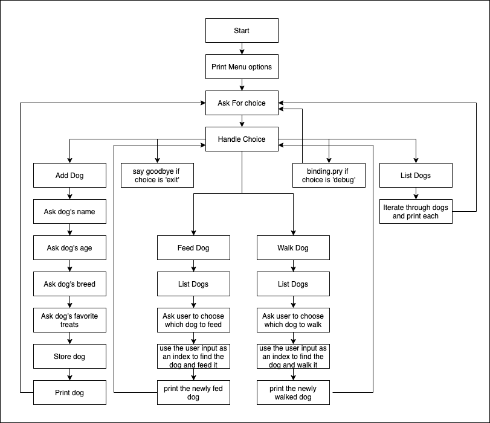

# Intro to Object Oriented Ruby

## Key Concepts for the day:

- Classes
- Instances
- Initialize
- Instance Variables
- Instance Methods
- Setter & Getters
- Attribute Accessors
- Self

## Situations Where Object Oriented Design is well suited
>I want to have total control of what my objects look like by updating my class.

Here are some characteristics of applications that would lend themselves well to an OO design

- an application modeling a real world domain that has lots of government regulations with specific data storage requirements (health care, banking, insurance, etc.)
- an application designed to help workers accomplish well established tasks that have consistent data requirements (sales, eCommerce, accounting, booking software for restaurants or hotels) 

Object Oriented design would help me clearly define the responsibilities of the different objects in my program and how they are related to other objects in the program. 

#### Situations where object oriented design presents obstacles
>Because I have total control, I don't have the flexibility to change my object's attributes without changing my class first.

If I were building a social media application, being able to iterate quickly and experiment with new features without having to make a more significant commitment to a change is a benefit. If we're in a situation where we're interacting with data from multiple external sources and we don't have control over the attributes present, an object oriented approach can slow us down. Think about the difference between having a Dog class and having a hash containing information about the dog. If we want to add information to the dog hash, we just add it, but if we want Dog instances to have more information attached to them, we have to change the class first.

#### Strengths
- It models the real world very well.
- OOP offers code reusability. The ability to encapsulate data and behavior within classes allows us to model relationships between different ideas and real world objects quite accurately.
- Different classes allow us to easily implement separation of concerns throughout our application.

#### Challenges
- OOP code is generally slower than functional code. 
- Testing Object Oriented code requires more setup
- Because so much abstraction is involved, if we're building an application where our requirements are rapidly changing, committing to the wrong abstraction can require more work to refactor and adjust than it would with functional code.

## Dog Walker CLI Part 2
### Key Features we're going to add to our Dog Walker CLI:

- Add the ability to feed a dog
- Add the ability to take a dog on a walk

### Key Refactors for Dog Walker CLI

- create a Dog class
  - attributes for name, age, breed, last_walked_at, last_fed_at
  - add a `walk` method which sets the `last_walked_at` time to the current time
  - add a `feed` method which sets the `last_fed_at` time to the current time
  - add a `needs_a_walk?` method which returns `true` if the `last_walked_at` time either doesn't exist or is more than 4 hours ago and `false` if not
  - add a `needs_a_meal?` method which returns `true` if the `last_fed_at` time either doesn't exist or is more than 6 hours ago and `false` if not
  - add a `print` method which will handle printing the dog information to the standard output
- In CLI
  - Add menu options for walking and feeding dogs
  - After choosing those options, create logic to allow users to choose which dog they want to walk/feed
  - refactor the parts of the cli that were expecting a dog hash to work with a dog instance instead.
    - `DOGS` should store an array of instances of the Dog class instead of an array of hashes
    - within the `add_dog` method, we'll create an instance of the `Dog` class instead of a hash
    - instead of calling print_dog and passing the dog hash, we'll invoke `print` directly on the dog

### Logistics

- The code for our cli will be written in the file `lib/dog_walker_cli.rb`. 
- We'll create another file called `lib/dog.rb` where we'll define our `Dog` class
- Again, we'll start our cli application by running the following command in our terminal:

```bash
./bin/run
```

### New dependencies

For today, we're going to be working with `DateTime` objects to determine whether a dog needs a walk or a meal. There is a library that adds a bunch of useful methods for working with dates, so we're going to add it as a dependency. The gem is called `activesupport` (a part of the Ruby on Rails gem) and we can add it with the following command:

```bash
bundle add activesupport
```
This will update the Gemfile in the following way.
```ruby
# Gemfile
# ...

gem "activesupport", "~> 6.1"
```
Next, because `activesupport` is built in a more modular way, the `Bundler.require(:default)` isn't enough to get what we need, so we're going to require the pieces we want to work with within the `config/environment.rb` file.
```rb
# config/environment.rb
# ...
require "date"
require "active_support/core_ext/integer/time"
require "active_support/core_ext/date/calculations"
```

The integer extension allows us to convert integers into duration objects and do math on them. For example:

```rb
[1] pry(main)> 1.hours
=> 1 hour
[2] pry(main)> 1.hour.ago
=> 2021-08-30 14:00:18 -0700
[3] pry(main)> DateTime.now < 1.hour.ago
=> false
[4] pry(main)> DateTime.now > 1.hour.ago
=> true
```

This allows us to:
- compare times with reference to the current time
- If one time is greater than another, that means that the greater time is later than the lesser time.
- We can also take a time and add a duration to it to get another time after it
- Or we can take a time and subtract a duration from it and get another time before it

We'll be using this knowledge in our `needs_a_walk?` and `needs_a_meal?` methods.

## The Dog Class

- We want to be able to initialize a new instance of the Dog class with a name, age, breed, and favorite_treats property
- attributes: name, age, breed, favorite_treats, last_walked_at, last_fed_at
  - getters and setters for all attributes
- `walk` method and `feed` method to update `last_walked_at` and `last_fed_at` attributes
- `print` method that will print out the dog's attributes and whether they need a meal or need a walk.


Here's a sketch of the flow of the program we're going to create:



## Important Errors To Understand

### NoMethodError
If you see a NoMethodError there are 3 pieces of information to latch onto:

/Users/dakotamartinez/Development/flatiron/iterations/SENG-LIVE-071921/phase-3/02_intro_to_object_oriented_ruby/demo/lib/dog.rb:12:in `print': undefined method `name' for #<Dog:0x00007f9f17901b28> (NoMethodError)

- Check the line number where it happened lib/dog.rb:12 (line 12)
- the name of the method that was called on that line
- the object the method was called upon.

The problem is usually one of 2 things:

- The right method was called on the wrong object
- The wrong (or undefined) method was called on the right object

You need to check:

- Is the method being called on the right object?
- Is the method being called the right method (is it misspelled?)