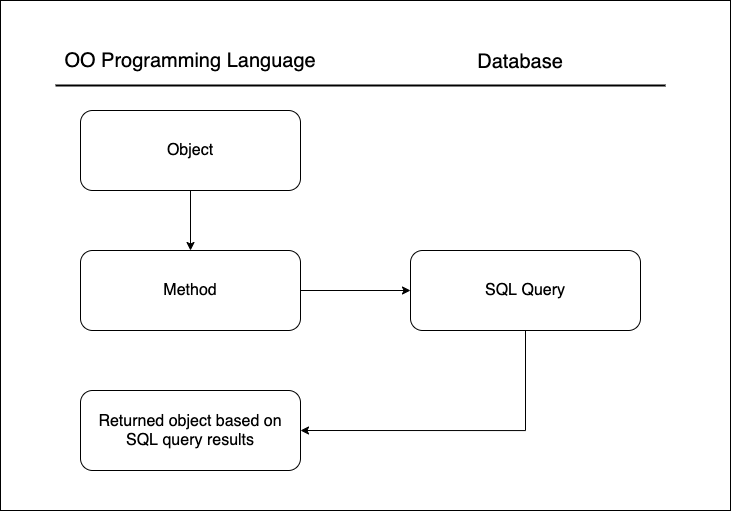
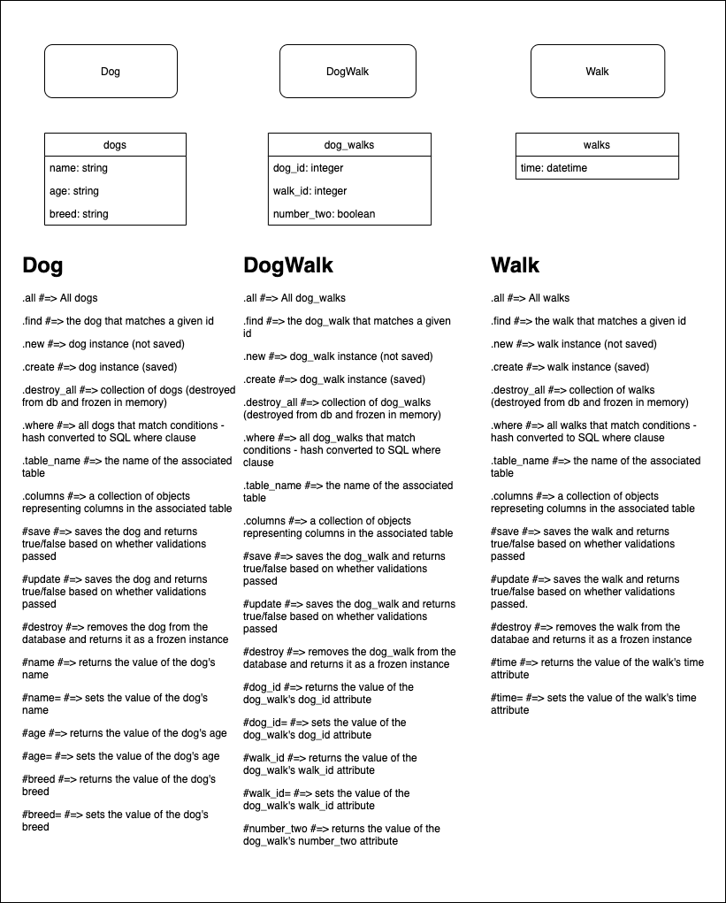

# What is Object Relational Mapping?




## An Example

```rb
class Dog
  attr_accessor :id, :name, :age, :breed, :image_url

  def self.all
    rows = DB.execute("SELECT * FROM dogs")
    rows.map do |row|
      self.new(row)
    end
  end

  def initialize(attributes = {})
    @id = attributes["id"]
    @name = attributes["name"]
    @age = attributes["age"]
    @breed = attributes["breed"]
    @image_url = attributes["image_url"]
  end
end

class DogWalk 
  attr_accessor :id, :dog_id, :walk_id, :number_two

  def self.all
    rows = DB.execute("SELECT * FROM dog_walks")
    rows.map do |row|
      self.new(row)
    end
  end

  def initialize(row)
    @id = row["id"]
    @dog_id = row["dog_id"]
    @walk_id = row["walk_id"]
    @number_two = row["number_two"]
  end
end

class Walk 
  attr_accessor :id, :time

  def self.all
    rows = DB.execute("SELECT * FROM walks")
    rows.map do |row|
      self.new(row)
    end
  end

  def initialize(row)
    @id = row["id"]
    @time = row["time"]
  end
end
```
# Why do I need an ORM?



## What are the repeating patterns here?

- we have a table associated with each of our classes
- we have a bunch of methods that do nearly the same thing while interacting with the database
- we have setter and getter methods that correspond to the column names in associated tables

## How can we apply metaprogramming & inheritance to implement these patterns?

- Using inheritance, we can create a base class that implements the common patterns and
- Using metaprogramming, we can handle the variations in those patterns
- By following strict naming conventions, we can avoid creating these methods over and over again and allow metaprogramming + inheritance to implement the patterns for us.

### We have a table associated with each of our classes

- We can create a method called `.table_name` that returns the name of the associated table.
- Rather than creating this method for every class, we add the method to our base class.
- The name of the class upon which we invoke `.table_name` determines the return value of the method.


### We have a bunch of methods that do nearly the same thing while interacting with the database

- We can define these methods in our base class and use metaprogramming to handle variations
- the `.columns` method will use the `.table_name` method to query the database for the column names and types
- We can use the `columns` method to create attribute accessors for all of the attributes.
- This will allow us to go back and forth between a row in the database and an instance of the class created from the attributes stored in that row.
  - Every time we call `.find` on a class, an instance is created from a row in the database
  - Every time we call `#save` on an instance, that instance's attributes are saved into a row in the database.
- The relationship between a class and its associated database table's structure allows us to automatically access information from the database without switching languages to SQL.

#### Examples
In a rake console, we can try these
```rb
Dog.find(4)
D, [2021-08-02T17:04:12.792619 #86885] DEBUG -- :   Dog Load (0.2ms)  SELECT  "dogs".* FROM "dogs" WHERE "dogs"."id" = ? LIMIT ?  [["id", 4], ["LIMIT", 1]]
=> #<Dog:0x00007fc90c1ebc98
 id: 4,
 name: "Kaya",
 age: "3 years",
 breed: "Blueheeler",
 image_url:
  "https://scontent.fapa1-2.fna.fbcdn.net/v/t1.18169-9/21762207_10212937843515095_6836989904941765671_n.jpg?_nc_cat=102&ccb=1-3&_nc_sid=cdbe9c&_nc_ohc=d1fqbEnFq5QAX-4Lkf9&_nc_ht=scontent.fapa1-2.fna&oh=f0b2d77c14ba93b5e0f143f12267a7cc&oe=612849B7">
```

```rb
Walk.all
D, [2021-08-02T17:04:43.329039 #86885] DEBUG -- :   Walk Load (0.4ms)  SELECT "walks".* FROM "walks"
=> [#<Walk:0x00007fc90b1e67d0 id: 1, time: 2021-08-02 00:00:00 UTC, created_at: 2021-08-02 23:38:20 UTC, updated_at: 2021-08-02 23:38:20 UTC>,
 #<Walk:0x00007fc90b1e65c8 id: 2, time: 2021-08-03 00:00:00 UTC, created_at: 2021-08-02 23:38:20 UTC, updated_at: 2021-08-02 23:38:20 UTC>,
 #<Walk:0x00007fc90b1e6488 id: 3, time: 2021-08-01 00:00:00 UTC, created_at: 2021-08-02 23:38:20 UTC, updated_at: 2021-08-02 23:38:20 UTC>]
```

```rb
DogWalk.create(dog_id: 1, walk_id: 3, number_two: false)
D, [2021-08-02T17:06:33.346556 #86885] DEBUG -- :    (1.3ms)  begin transaction
D, [2021-08-02T17:06:33.366475 #86885] DEBUG -- :   DogWalk Create (12.3ms)  INSERT INTO "dog_walks" ("number_two", "dog_id", "walk_id") VALUES (?, ?, ?)  [["number_two", "f"], ["dog_id", 1], ["walk_id", 3]]
D, [2021-08-02T17:06:33.368186 #86885] DEBUG -- :    (1.3ms)  commit transaction
=> #<DogWalk:0x00007fc90b278a18 id: 11, number_two: false, dog_id: 1, walk_id: 3>
```