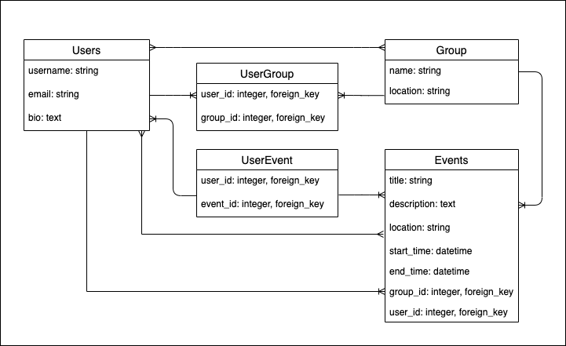

# Phase 4 - Lesson 1 - Rails Fundamentals

In this phase we will be building on our knowledge of Ruby and ActiveRecord from Phase 3 to:
- build RESTful APIs with Ruby on Rails
- validate data and return responses with appropriate status codes so that we can give our users more meaningful feedback in API responses
- build applications that include user authentication and access control. 
- deploy our applications so we can share them with friends, family and potential employers

For our application we build together, we'll be working on a meetup clone. The app that you'll be building in exercises is a reading list application. We'll again be adding new features every day, but this time, you'll be working on the app on your own machine day by day. So, you'll want to be keeping up with the work for each day so you'll be ready to participate during the exercise the following day.

## Lesson 1 Todos

### Instructions for Demo

1. Create a new rails application for our reading list application. 
`rails new meetup_clone_api --api --minimal -T`
Note: Do not forget the --api! The rails application will not be configured correctly if you do! If you forget it, delete the application and re-create it. 
2. Configure cors by uncommenting the `gem 'rack-cors'` and going to `config/initializers/cors.rb` and uncommenting the code below (make sure to replace `'example.com'` with `*` within origins):

```rb 
Rails.application.config.middleware.insert_before 0, Rack::Cors do
   allow do
     origins '*'

     resource '*',
       headers: :any,
       methods: [:get, :post, :put, :patch, :delete, :options, :head]
   end
 end
```
3. Create the following migrations for meetup_clone

Note: you do not need to write the tables yourself. There is a way to automatically generate the table with the corresponding columns using rails generators

4. Go to Models and add the association macros to establish the relationships pictured in the Entity Relationship Diagram (ERD). 
5. In the rails console OR in seeds create seeds for user and books and test your relationships. (You'll want to create groups that are related to users and events that are related to groups, try checking out the [has_many](https://apidock.com/rails/ActiveRecord/Associations/ClassMethods/has_many) docs for examples)
6. In `config/routes.rb` add an index and show route for books
7. In the Books controller add an index action that renders all of the books in json. Make a show action that renders 1 book’s information given the id (as a bonus, try to include the book’s users as well. 
8. Run your rails server and go to the browser (or use postman) to check that your json is being rendered for both routes


